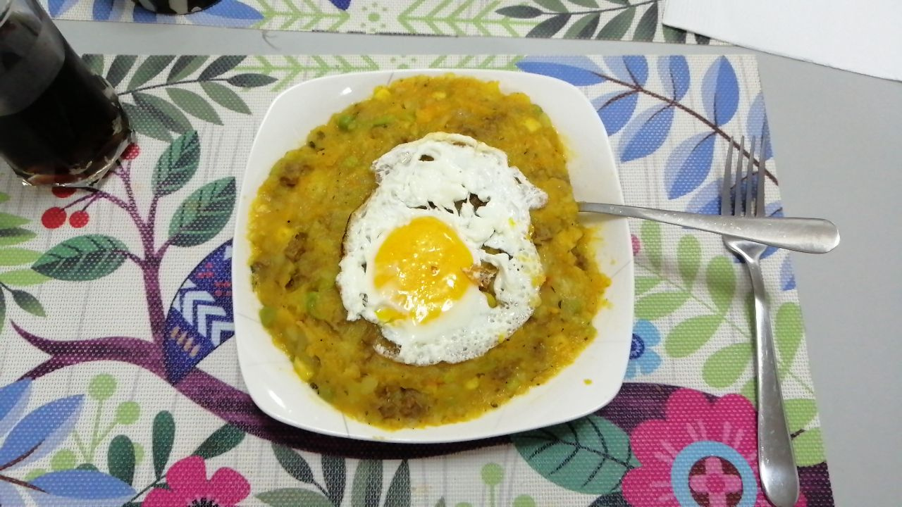

# Charquicán

40-50 min, 4 servings.

## Ingredients
### Mash
- 500g Potato, cubed
- 500g Pumpkin, cubed
- 1 cup Peas
- 1 cup Corn
- ½ Carrot
- 1 leaf Spinach or Chard
- 200g Stock
- 1 tbsp Oregano
- Salt, to taste

### Sautée
- 500g Ground Meat
- 1 Onion, chopped
- 1 Garlic clove
- 1 tsp Cumin
- ⅓ Bell Pepper, chopped
- 1 tsp Oregano
- Salt and black pepper to taste

### Additional
- 1 Egg per serving

## Preparation
Peel and chop the potatoes and the pumpkin in 2cm cubes. Shred carrot and finely chop spinach.

Throw potato, pumpkin, peas, corn, shredded carrot, spinach and stock, in a pot, fill with water, everything submerged. Add salt and oregano. On stove, high heat until it boils. Then turn to medium.

In the meantime chop onion and bell pepper in small cubes, mash, chop, grind garlic. Throw all three in a pan with oil and sautée, with salt, pepper cumin, and oregano. Add the meat/protein. Cook it well.

If either thing starts getting dry, add a bit of water.

Wait until potato and pumpkin and very soft then take out of the stove, pour all the water in a separate container. Mash a bit, but retain some chunkiness. If it looks too dry while stirring and mashing, start adding back some of the water you saved. When you’re happy with the texture, add the sautéed ingredients. Mix thoroughly. 

Fry an egg sunny side up.

## Serving
Serve on a plate with the fried egg on top.

## Vegetarian Options
Ground meat can be replaced either with seitan, soy protein or tofu. For seitan and tofu, make sure to squeeze all the water out beforehand. Soy protein should be properly rehydrated beforehand.

For all three of these, soak them in soy sauce for 15 minutes before adding them to the sautée.

## Final Notes
- Chicken stock works great, use vegetable stock for a vegan alternative!
- Most ingredients are to taste, experiment with the proportions!
- Save the egg yolk for the last bite for maximum enjoyment!