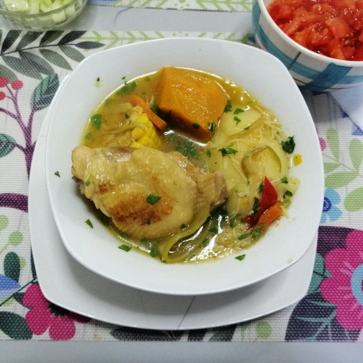

[Back to Index](../../index.md)

# Fam’s Improved Chilean Chicken Cazuela

30-40 minutes, 2 sevings.

## Ingredients
- Olive oil
- Chicken drumsticks or thighs
- 4 medium sized potatoes
- 500g Chilean pumpkin or squash
- 2 corn cobs
- 1/2 large onion
- Green beans
- Angel hair noodles
- 1 carrot
- Cilantro
- Red bell pepper
- Cilantro

## Preparation

## Serving

## Vegetarian Options

## Final Notes
