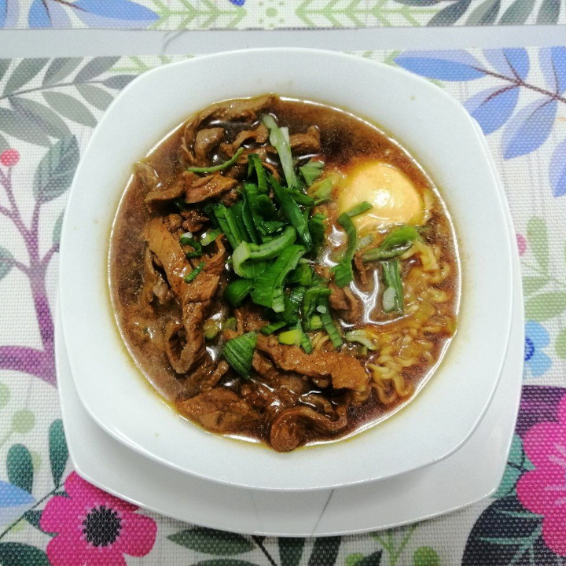

[Back to Index](../../index.md)

# Fam’s World Famous Emergency Ramyun

15 min, 1 serving.

## Ingredients
### Noodles and broth:

- 1 Maruchan® Ramen Noodle Soup (85g)
- 1 Large Green Onion (incl. leaves)
- 1 Egg
- ¼ cup Mirin
- 1 tsp Sesame Oil
- ½ tsp Sugar
- 1 tsp Garlic Powder1
- ½ tsp Monosodium Glutamate
- Soy sauce, to taste

### Suggested topping, stir fried beef:

- 130g beef, cut in thin slices
- 1 tsp Sesame Oil
- 1 tsp Ground Pepper
- ½ tsp Garlic Powder1
- Soy sauce, to taste

## Preparation
Cut the leaves off the green onion and chop them into small pieces, set them apart. Cut the white bulb in half, and chop the pieces into 5mm wide strips. Put these strips in a small pot and add the sesame oil. Put the pot on high heat and sautée the white part of the green onion. As soon as it starts browning add 3 cups of boiling water and wait for it to start boiling again. Add the sugar, garlic powder, monosodium glutamate and seasoning from the Maruchan noodles into the pot, mix thoroughly. Adjust the flavor by adding soy sauce, this will be really close to the final flavor of the broth. Wait for it to start boiling again and add the mirin, wait for the alcohol to evaporate.

If you’re preparing the stir fried beef, make sure to have a pan with oil in it ready.

Have a timer ready to start counting down exactly three minutes. Add the noodles, and as soon as they go in, start the timer. If you’re preparing the beef, add it to the pan. This next part is very time sensitive.

Stir the beef until it’s moderately sealed, and then add the soy sauce and the rest of the seasonings, continue stirring. Do not touch the noodles until the timer hits 2 minutes, at that moment use a wooden spoon to separate them and distribute them around the pot. Continue stirring the beef.

As soon as the timer hits one minute, add the egg to the soup (do not crack it at 1 minute, have it pre-cracked and ready to go), you should add the egg as close to the side of the pot as you can. If done correctly, the egg should be comfortably in one piece mostly surrounded by noodles.

When the timer ends, drop the broth heat to low and put a lid on it, continue cooking for 20 seconds. Remove both the pan and the pot from the heat. 

## Serving
Very carefully transfer the broth and the noodles into a bowl, making sure the egg yolk doesn’t break. Place the toppings around the bowl. Garnish with the chopped green onion leaves.

## Vegetarian Options
There’s no need to use either animal-based broths or toppings. You can easily replace the beef with mushroom and it will taste just as great. Refer to the notes for more toppings, most of which are in fact vegetarian.

## Final Notes
- Finely minced garlic works just as great as powder.
- The beef can easily be replaced by pork or mushrooms.
- For a spicier experience, you can add gochujang, gochugaru or even merkén to the broth.
- Other very tasty toppings you can add to your ramyun include, but are not limited to: Shredded green onion bulb, Soy bean sprouts, Kimchi, Nori, Pickled Ginger, Corn, Korean Fish Cakes, Korean Rice Cakes
- Honestly when it comes to top your ramyun, experiment!