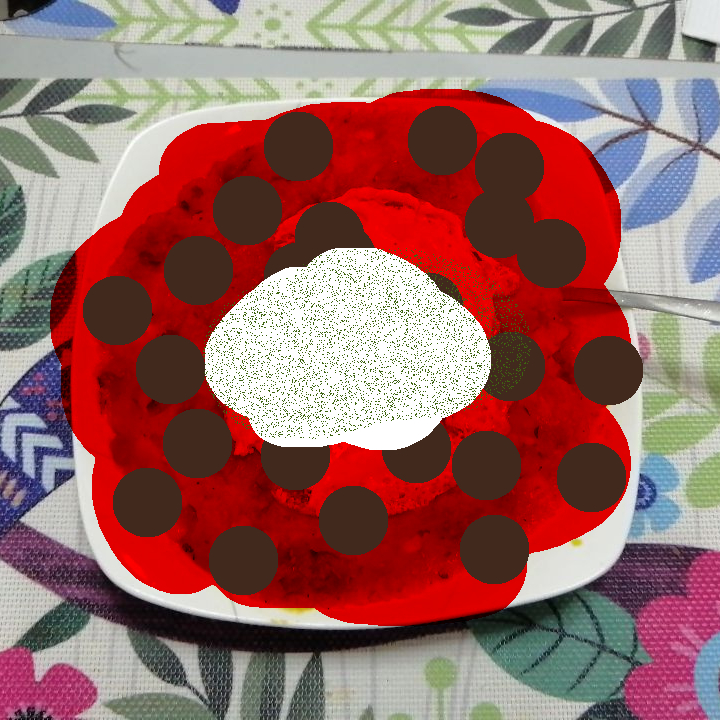

[Back to Index](../../index.md)

# Hungarian Goulash

40-50 min, 4 servings.

## Ingredients
- 600-800g pork meat
- 350ml tomato sauce
- 1 tomato, diced
- 350ml red wine
- 1 large onion
- Garlic
- 250ml chicken or vegetable stock
- Some carrot?
- idk mang

### Additional
- A scoop of Creme Fraiche or Sour Cream
- A pinch of dill leaves

## Preparation

## Serving
Serve hot, with plenty of sauce, on a plate of white rice or baked potatoes, add a scoop of cream on top and sprinkle some dill leaves.

## Vegetarian Options
Pork can be easily replaced with firm tofu, the stirring has to be a bit gentler.

## Final Notes
- Garlic, dill and pepper are to taste, experiment with the proportions!